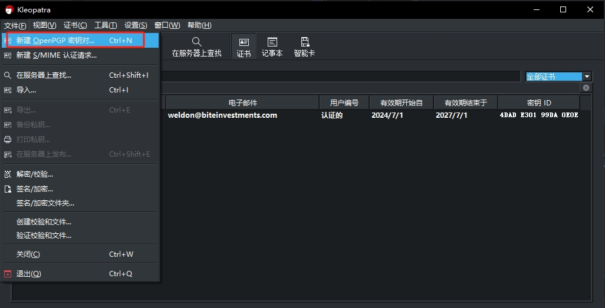
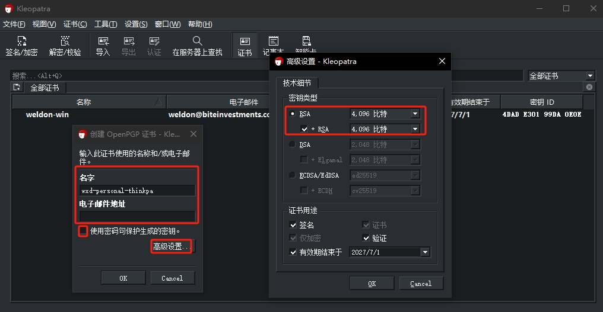
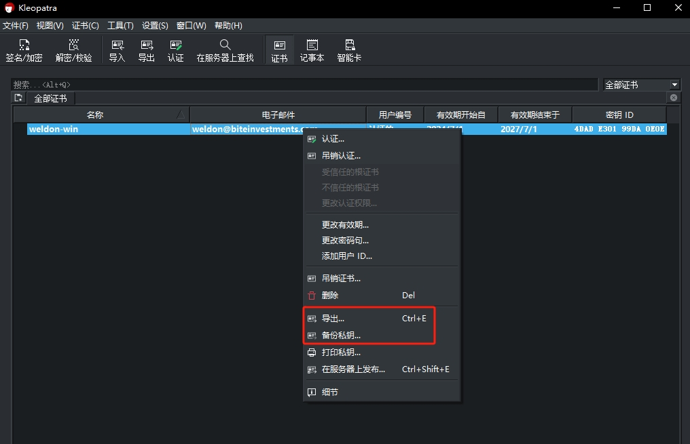
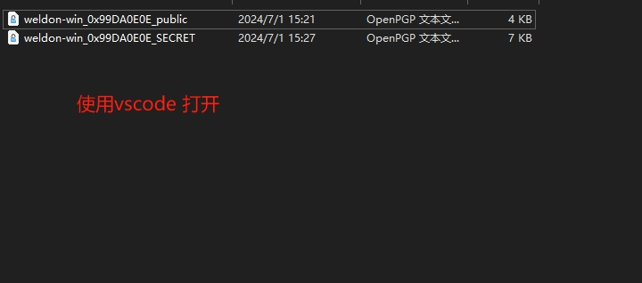

# Windows 生成新 GPG 密钥 并添加到 Github

参考:

- [Markdown 官方教程](https://markdown.com.cn/basic-syntax/images.html)
- [GitHub 生成新 GPG 密钥](https://docs.github.com/zh/authentication/managing-commit-signature-verification/generating-a-new-gpg-key?platform=windows)

---------------

>如果没有现有的 GPG 密钥，您可以生成新的 GPG 密钥以用于签名提交和标记。

**GitHub 支持多种 GPG 密钥算法。 如果您尝试添加使用不支持的算法生成的密钥，可能会发生错误。**

- RSA
- ElGamal
- DSA
- ECDH
- ECDSA
- EdDSA

## 生成 GPG 密钥
** 注意：**
在生成新 GPG 密钥之前，请确保已验证你的电子邮件地址。 如果尚未验证电子邮件地址，将无法使用 GPG 对提交和标记进行签名。
有关详细信息，请参阅[验证电子邮件地址](https://docs.github.com/zh/account-and-profile/setting-up-and-managing-your-personal-account-on-github/managing-email-preferences/verifying-your-email-address)。

## 下载并安装适用于操作系统的 [GPG 命令行工具](https://www.gnupg.org/download/) 

### 方法一 (经过测试，这条路不通)

#### 按提示安装完 GPG 工具后，会弹出他的桌面UI `Kleopatra`

#### 第一步　新建`openGPG`密钥对



#### 第二步　设置`openGPG`密钥对（/名字/邮箱/密码/密钥类型rsa4096/用途/有效期/）


#### 第三步　导出/备份`openGPG`公钥/私钥


#### 第四步 上传`openGPG`公钥至GitHub



### 方法二

#### 打开Git Bash。

#### 生成 GPG 密钥对。 由于 GPG 有多个版本，因此可能需要查阅相关手册页来查找相应的密钥生成命令。

如果您使用的是 2.1.17 或更高版本，请粘贴以下文本以生成 GPG 密钥对。

```Shell
gpg --full-generate-key
```

如果使用的不是版本 2.1.17 或更高版本，则 gpg --full-generate-key 命令不起作用。 请粘贴以下文本并跳到第 6 步。

```Shell
gpg --default-new-key-algo rsa4096 --gen-key
```

#### 在提示时，指定要生成的密钥类型，或按 Enter 键接受默认值。

#### 在提示时，指定要生成的密钥大小，或按 Enter 键接受默认值。

#### 输入密钥的有效时长。 按 Enter 键将指定默认选择，表示该密钥不会过期。 除非你需要过期日期，否则我们建议接受此默认值。

#### 验证您的选择是否正确。

#### 输入您的用户 ID 信息。

> 注意：要求你输入电子邮件地址时，请确保输入 GitHub 帐户的经过验证的电子邮件地址。 要将电子邮件地址保密，请使用 GitHub 提供的 no-reply 电子邮件地址。 有关详细信息，请参阅“验证电子邮件地址”和“设置提交电子邮件地址”。

#### 输入安全密码。

#### 使用 `gpg --list-secret-keys --keyid-format=long` 命令列出你拥有其公钥和私钥的长形式 GPG 密钥。 签名提交或标记需要私钥。

```
Shell
gpg --list-secret-keys --keyid-format=long
```

>注意：Linux 上的某些 GPG 安装可能需要改用 gpg2 --list-keys --keyid-format LONG 查看现有密钥的列表。 在这种情况下，还需要通过运行 git config --global gpg.program gpg2 来配置 Git 以使用 gpg2。

#### 从 GPG 密钥列表中复制您想要使用的 GPG 密钥 ID 的长形式。 在本例中，GPG 密钥 ID 为 3AA5C34371567BD2：

```Shell

$ gpg --list-secret-keys --keyid-format=long
/Users/hubot/.gnupg/secring.gpg
------------------------------------
sec   4096R/3AA5C34371567BD2 2016-03-10 [expires: 2017-03-10]
uid                          Hubot <hubot@example.com>
ssb   4096R/4BB6D45482678BE3 2016-03-10
```

粘贴下面的文本（替换为您要使用的 GPG 密钥 ID）。 在本例中，GPG 密钥 ID 为 3AA5C34371567BD2：

```bash
gpg --armor --export 3AA5C34371567BD2
# Prints the GPG key ID, in ASCII armor format
```

#### 复制以 -----BEGIN PGP PUBLIC KEY BLOCK----- 开头并以 -----END PGP PUBLIC KEY BLOCK----- 结尾的 GPG 密钥。

#### 将 GPG 密钥新增到 GitHub 帐户。


